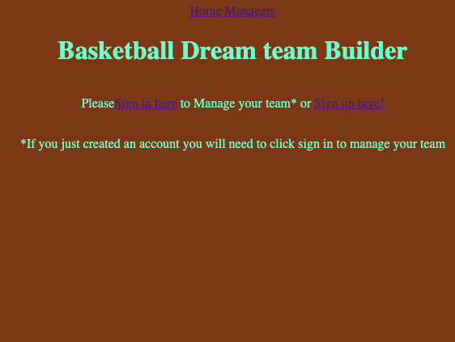

# Build Your Basketball Dream Team

## Why I made this app
I put this together for my Software Engineering Boot Camp. I learned a lot of ways to trouble shoot and the overcome many problems. I really enjoy basketball so I wanted to give people the opportunity to play create their dream team.

## How it works
You will need to create a manager profile to start. Once created you will need to sign in to actually manage your team. Once logged in you can create your team and then you can addd players to it. You can browse other managers without creating a team but you wont have anything for others to view if you don't.

## Technologies used

- HTML
- CSS
- Node.js
- Express
- MongoDB

## Attributions

I leaned a lot on previous app examples we made in class and some videos made available to us by my instructor Arthur. 

## Future Plans
- Implement ratings